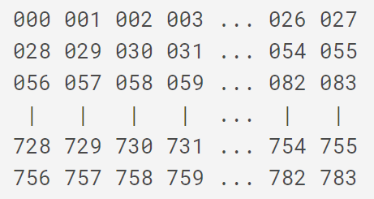
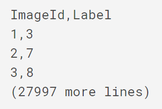

# Digit Recognizer

Entering a beginner image classification competition in Kaggle to get some practice in deep learning and computer vision.

### Competition Description
MNIST ("Modified National Institute of Standards and Technology") is the de facto “hello world” dataset of computer vision. Since its release in 1999, this classic dataset of handwritten images has served as the basis for benchmarking classification algorithms. As new machine learning techniques emerge, MNIST remains a reliable resource for researchers and learners alike.

In this competition, your goal is to correctly identify digits from a dataset of tens of thousands of handwritten images. We’ve curated a set of tutorial-style kernels which cover everything from regression to neural networks. We encourage you to experiment with different algorithms to learn first-hand what works well and how techniques compare.

## Goal
The goal is to take an image of a handwritten single digit, and determine what that digit is. For every image in the test set, we want to predict the correct label.

## Metric
This competition is evaluated on the categorization accuracy of the predictions (the percentage of images labeled correctly).

## Data Description
The data files train.csv and test.csv contain gray-scale images of hand-drawn digits, from zero through nine.

Each image is 28 pixels in height and 28 pixels in width, for a total of 784 pixels in total. Each pixel has a single pixel-value associated with it, indicating the lightness or darkness of that pixel, with higher numbers meaning darker. This pixel-value is an integer between 0 and 255, inclusive.

The training data set, (train.csv), has 785 columns. The first column, called "label", is the digit that was drawn by the user. The rest of the columns contain the pixel-values of the associated image.

Each pixel column in the training set has a name like pixelx, where x is an integer between 0 and 783, inclusive. To locate this pixel on the image, suppose that we have decomposed x as x = i * 28 + j, where i and j are integers between 0 and 27, inclusive. Then pixel x is located on row i and column j of a 28 x 28 matrix, (indexing by zero).

For example, pixel 31 indicates the pixel that is in the fourth column from the left, and the second row from the top, as in the ascii-diagram below.

Visually, if we omit the "pixel" prefix, the pixels make up the image like this:

The test data set, (test.csv), is the same as the training set, except that it does not contain the "label" column.

The submission file should be in the following format: For each of the 28000 images in the test set, output a single line containing the ImageId and the digit predicted. For example, if we predict that the first image is of a 3, the second image is of a 7, and the third image is of a 8, then your submission file would look like:

The evaluation metric for this contest is the categorization accuracy, or the proportion of test images that are correctly classified. For example, a categorization accuracy of 0.97 indicates that all but 3% of the images have been correctly classified.

### Acnkowledgements
More details about the dataset, including algorithms that have been tried on it and their levels of success, can be found [here](http://yann.lecun.com/exdb/mnist/index.html). The dataset is made available under a [Creative Commons Attribution-Share Alike 3.0 license](https://creativecommons.org/licenses/by-sa/3.0/).
